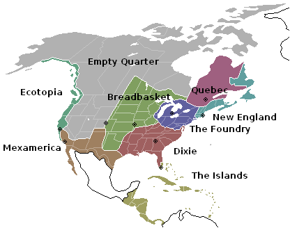

```{r, echo=FALSE, warning=FALSE, message=FALSE}
suppressPackageStartupMessages(library(dplyr))
suppressPackageStartupMessages(library(rgdal))
suppressPackageStartupMessages(library(ggplot2))
suppressPackageStartupMessages(library(rvest))
suppressPackageStartupMessages(library(tidyr))
suppressPackageStartupMessages(library(maps))
suppressPackageStartupMessages(library(maptools))
suppressPackageStartupMessages(library(ggmap))
suppressPackageStartupMessages(library(lubridate))
suppressPackageStartupMessages(library(magrittr))
suppressWarnings(invisible(gpclibPermit()))
```


## Question 1:

Let's start by looking at breast cancer data, by census tract, in western Washington state. We'll use the data to make three plots:

* A map of overall breast cancer incidence rate for each census tract:  $\frac{y_i}{N_i}$ where for each census tract $i=1,\ldots,n$
    + $y_i$ is the total number of cases
    + $N_i$ is the total number of people
* A map of the median income **quintiles**.  
* A map of that gives a sense of census tracts with high and low breast cancer incidence rates *while taking income into account*.  

### Breast Cancer Incidence Rate
```{r, echo=FALSE}
# Import data and clean data.
SEER <- read.csv("Space Time Surveillance Counts 11_05_09.txt", header=TRUE) %>% tbl_df()
names(SEER)[1] <- "FIPS"

cancer.data <- SEER %>%
  filter(SiteRecodeTxt == "Breast ") %>%
  group_by(FIPS) %>%
  summarize(cancer_counts = n())
```

```{r, echo=FALSE}
# Convert shapefile into "Spatial Polygons" AKA "sp" object
WW <- readOGR(dsn=".", layer="ww", verbose=FALSE) 
WW.data <- WW@data %>% tbl_df()

suppressWarnings(
  WW.map <- fortify(WW, region="FIPS") %>% 
    tbl_df() %>%
    left_join(WW.data, by=c("id" = "FIPS"))
)

WW.map$id <- as.numeric(WW.map$id)

WW.map <- left_join(WW.map, cancer.data, by = c("id" = "FIPS")) %>%
  mutate(cancer_rate = cancer_counts/POP2000)

ggplot(data=WW.map, aes(x=long, y=lat, group=group, fill = cancer_rate)) +
  geom_polygon() +
  geom_path(color="black", size=0.5) +
  xlab("longitude") + ylab("latitude")
```

It's hard to see exactly what's going on in the smaller census tracts, so let's try zooming in. 

```{r,echo=FALSE, fig.with = 1.5, fig.height = 6}
ggplot(data=WW.map, aes(x=long, y=lat, group=group, fill = cancer_rate)) +
  geom_polygon() +
  geom_path(color="black", size=0.5) +
  xlab("longitude") + ylab("latitude") +
  coord_cartesian(xlim = c(-122.75, -122), ylim = c(47.0, 48.0))
```

Both plots indicate that the incident rate of breast cancer is somewhere betweeen 0.5% to 2.5%, though we do see one outlier with a rate of about 4%. Additionally, there doesn't seem to be any clear pattern between rural areas and the more metropolitan areas around Seattle and Tacoma.

### Median Income
```{r,echo=FALSE}
census <- read.csv("census2000.csv", header=TRUE) %>% tbl_df()
names(census)[names(census)=="Geo_FIPS"] <- "FIPS_code"
names(census)[names(census)=="SE_T093_001"] <- "Median_Household_Income"
census$income_quantile <- 0

# Breaks up census tracks into quantiles.
for(i in 1:5){
  u <- quantile(census$Median_Household_Income, (i/5))[[1]]
  l <- quantile(census$Median_Household_Income, ((i-1)/5))[[1]]
  for(j in 1:nrow(census)){ 
    if(l <= census$Median_Household_Income[j] && u >= census$Median_Household_Income[j]){
      census$income_quantile[j] <- i   
      }
    }
  }

WW.map <- left_join(WW.map, census, by = c("id" = "FIPS_code"))

ggplot(data=WW.map, aes(x=long, y=lat, group=group, fill = factor(income_quantile))) +
  geom_polygon() +
  geom_path(color="black", size=0.5) +
  xlab("Longitude") + ylab("Latitude") + 
  scale_fill_brewer(palette="YlOrRd", 
                    name="Median Income ($)",
                    breaks=c(1,2,3,4,5),
                    labels=c("0 to 35,109","35,110 to  42,160",
                             "42,161 to 49,990","49,991 to 60,245","60,246 to 133,756")) 

```

And another quick zoom to make sure we don't lose the little guys.

```{r,echo=FALSE, fig.with = 1.5, fig.height = 6}
ggplot(data=WW.map, aes(x=long, y=lat, group=group, fill = factor(income_quantile))) +
  geom_polygon() +
  geom_path(color="black", size=0.5) +
  xlab("Longitude") + ylab("Latitude") + 
  scale_fill_brewer(palette="YlOrRd", 
                    name="Median Income ($)",
                    breaks=c(1,2,3,4,5),
                    labels=c("0 to 35,109","35,110 to  42,160",
                             "42,161 to 49,990","49,991 to 60,245","60,246 to 133,756")) + 
  coord_cartesian(xlim = c(-122.75, -122), ylim = c(47.0, 48.0))
```

Interestingly, the image shows that most of the wealthiest areas are just outside of the cities, not actually in the cities themselves.

### Breast Cancer and Median Income

We will make our metric the product of the incident cancer rate and the median household income. The higher values will be census tracts in which either the cancer rate is higher than usual, and/or the median income is larger than usual. 

```{r, echo=FALSE}
WW.map %<>% mutate(income_cancer = Median_Household_Income*cancer_rate)

ggplot(data=WW.map, aes(x=long, y=lat, group=group, fill = income_cancer)) +
  geom_polygon() +
  geom_path(color="black", size=0.25) +
  xlab("Longitude") + ylab("Latitude") 
```

```{r, echo=FALSE, fig.with = 1.5, fig.height = 6}
ggplot(data=WW.map, aes(x=long, y=lat, group=group, fill = income_cancer)) +
  geom_polygon() +
  geom_path(color="black", size=0.5) +
  xlab("Longitude") + ylab("Latitude") + 
  coord_cartesian(xlim = c(-122.75, -122), ylim = c(47.0, 48.0))
```

Our image shows brighter spots in the wealthier areas, suggesting that wealthier communities tend to have higher rates of breast cancer. 

It's also worth taking a look at a plot of the two variables
```{r, echo=FALSE}
census <- left_join(census, cancer.data, by = c("FIPS_code" = "FIPS"))
names(census)[names(census)=="SE_T001_001"] <- "Total_Population"
census %<>% mutate(incidence = (cancer_counts/Total_Population))

suppressWarnings(
ggplot(census, aes(x = factor(income_quantile), 
                   y = incidence,
                   col = factor(income_quantile))) + 
  geom_boxplot(size = 1.5, outlier.size = 2) +
  xlab("Income Quantile") + ylab("Incident Breast Cancer Rate") + 
  scale_color_brewer(palette="YlOrRd", 
                    name="Median Income ($)",
                    breaks=c(1,2,3,4,5),
                    labels=c("0 to 35,109","35,110 to  42,160",
                             "42,161 to 49,990","49,991 to 60,245","60,246 to 133,756")) +
  ggtitle("Breast Cancer Rate by Income Quantile")
)
```

There does appear to be a slightly increasing trend, indicating that as the median household income increases, so does the incident rate of breast cancer. We can find the difference using an ANOVA test. We can set up a quick hypothesis test:

$H_0$: There is no increase between cancer rate and income quantiles.

$H_A$: There is an increase between cancer rate and income quantiles.

```{r, echo=FALSE}
trend <- aov(incidence ~ factor(income_quantile), data = census)
summary(trend)
```

With a p-val less than 0.05, we reject $H_0$ in favor of $H_A$. This means our data suggests that there is a statistically significant difference for the cancer rate, just a few fractions of a percent, between each income quantile.

## Question 2:

We'll now turn our attention to the 2000 U.S presidential election featuring republican candidate (and later, president) George W. Bush and democtratic candidate Al Gore. The data is from the [School of Public Affairs at American University in DC](http://www.american.edu/spa/ccps/Data-Sets.cfm), and keeps track of the number of votes per candidate by county. (Note: The county map is from 2010, whereas the election data is from 2000, so a few counties will not match up.  The number is not that large.)

Using this data, we'll make a map showing the proportion of voters who voted for Bush at a **state** level and at a **county** level. We'll have the red indicate the regions that favor Bush, the blue indicate the regions that don't favor him, and the white represent the regions that remained in the middle. 

```{r, echo=FALSE}
# White does a better job of showing the small differences than purple, 
# since it's easier to see a faint shade of pink than a slightly more 
# red shade of purple. However, if we must have it in purple, you can 
# change the following from "white" to "purple", and it will change all
# of the plots.

middlecolor <- "white"
```
With our data set, we will consider:

1. The biggest differences when changing from "census tract" resolution to "state" resolution.
2. How the maps align with the idea of the [Nine Nations of North America](http://en.wikipedia.org/wiki/The_Nine_Nations_of_North_America)
3. Which states exhibit the greatest **within state heterogeneity** in voting? 


```{r,echo = FALSE}
# This function eliminates all non-alphanumeric characters and spaces and 
# converts all text to lower case.
clean.text <- function(text){
  text <- gsub("[^[:alnum:]]", "", text)
  text <- gsub(" ", "", text)
  text <- tolower(text)
  return(text)
}

# State and county map of US in 2010
US.state <- map_data("state") %>% tbl_df()
US.state$region <- clean.text(US.state$region) 
US.county <- map_data("county") %>% tbl_df()
US.county$subregion <- clean.text(US.county$subregion)
```


### State

We'll start off at the state level, where we see quite a bit of red in the middle and light blue on the coasts.

```{r,echo=FALSE}
# Clean data.
election <- read.csv("COUNTY.csv", header=TRUE) %>% tbl_df()
election$COUNTY <- clean.text(election$COUNTY) 
election$STATE <- clean.text(election$STATE) 
election$BUSH <- as.numeric(election$BUSH) %>% na.omit()
election$GORE <- as.numeric(election$GORE) %>% na.omit()
election$NADER <- as.numeric(election$NADER)
election$BUCHANAN <- as.numeric(election$BUCHANAN)
election$BROWNE <- as.numeric(election$BROWNE)
election$PHILLIPS <- as.numeric(election$PHILLIPS)
election$WRITEINS <- as.numeric(election$WRITEINS)
election$HAGELIN <- as.numeric(election$HAGELIN)
election$MCREYNOLDS <- as.numeric(election$MCREYNOLDS)
election$HARRIS <- as.numeric(election$HARRIS)
election$DODGE <- as.numeric(election$DODGE)
election$NOTA <- as.numeric(election$NOTA)
election$MOOREHEAD <- as.numeric(election$MOOREHEAD)
election$BROWN <- as.numeric(election$BROWN)
election$VENSON <- as.numeric(election$VENSON)
election$YOUNGKEIT <- as.numeric(election$YOUNGKEIT)
election$LANE <- as.numeric(election$LANE)
election %<>%  mutate(OTHER = (BUCHANAN + BROWNE + PHILLIPS + WRITEINS + HAGELIN + MCREYNOLDS + HARRIS +
                                 DODGE + NOTA + MOOREHEAD + BROWN + VENSON + YOUNGKEIT + LANE))

# Make state data frame.
state.map <- election %>%
  group_by(STATE) %>%  
  group_by(STATE) %>% 
  summarise(BUSH = sum(BUSH), GORE = sum(GORE), OTHER = sum(OTHER))

state.map <- left_join(US.state, state.map, by = c("region"="STATE"))

# Full view.
ggplot(data=state.map, aes(x=long, y=lat, group=group, fill = (BUSH/(BUSH + GORE + OTHER)))) +
  geom_polygon() +
  geom_path(color="black", size=0.1) +
  xlab("Longitude") + ylab("Latitude") +
  coord_map() + 
  scale_fill_gradient2(name="", low="dodgerblue4", high="firebrick3", mid=middlecolor,
                       midpoint = 0.5,
                       na.value = "transparent")

# Zoomed up to NE.
ggplot(data=state.map, aes(x=long, y=lat, group=group, fill = (BUSH/(BUSH + GORE+ OTHER)))) +
  geom_polygon() +
  geom_path(color="black", size=0.1) +
  xlab("Longitude") + ylab("Latitude") +
  coord_map() + 
  scale_fill_gradient2(name="", low="dodgerblue4", high="firebrick3", mid=middlecolor,
                       midpoint = 0.5,
                       na.value = "transparent") + 
  coord_cartesian(xlim = c(-80, -67), ylim = c(35, 47.7)) 
```

### County

Now we focus our attention at the county level, to get a better sense of individual regions' preferences. 

```{r,echo=FALSE}
county.map <- left_join(US.county, election, by = c("subregion"="COUNTY"))

# Full view.
ggplot(data=county.map, aes(x=long, y=lat, group=group, fill = BUSH/(BUSH+GORE+OTHER))) +
  geom_polygon() +
  geom_path(color="black", size=0.01) +
  coord_map() + 
  xlab("Longitude") + ylab("Latitude") +
  scale_fill_gradient2(name="", low="dodgerblue4", high="firebrick3", mid=middlecolor,
                       midpoint = 0.5,
                       na.value = "transparent")

# Zoomed up to NE.
ggplot(data=county.map, aes(x=long, y=lat, group=group, fill = BUSH/(BUSH+GORE+OTHER))) +
  geom_polygon() +
  geom_path(color="black", size=0.01) +
  coord_map() + 
  xlab("Longitude") + ylab("Latitude") +
  scale_fill_gradient2(name="Percentage of Votes\nfor Bush", 
                       low="dodgerblue4", high="firebrick3", mid=middlecolor,
                       midpoint = 0.5,
                       na.value = "transparent") + 
  coord_cartesian(xlim = c(-100, -67), ylim = c(25, 50))
```

Now with the maps on the table, we can take a stab at answering some of the questions.

### State vs. County Resolution

Right off the bat we notice that looking at the counties map, we see a lot of red! It's difficult to get a sense for exactly how "blue" or "red" a state is since many of the counties that have the largest area (and are very sparsely populated) are red. The dark blue counties that rarely show up have a lot more weight than their size implies since they represent much more densley populated metropolitan areas. 

We'll take the example of California. If we look at the counties map, most of California is covered in red or pink except for the LA and SF regions. But looking at the state map, we see that overall the state voted democrat. 

### Nine Nations of North America

 (Image credit to "Ninenations" by A Max J.)

The counties map seems to fit well with the Nine Nations of North America idea. Starting on the NW coast, we see a lot more blue along the coast, corresponding to 'Ecotopia'. The 'Empty Quarter' is, for the most part, made up of large republican counties. Further south in 'Mexamerica', these counties start gaining some blue. This democrat skew is also seen in the "nation" of 'New England'. We look at the state map to spot the differences between the lightly-blue 'Foundry' and the red 'Dixie'. Finally, it's hard to get a sense for the "Breadbasket", since the political orientation doesn't seem as consistent as in the other "nations".

### Greatest Within State Heterogeneity

We get a sense for the most conflicted states by looking at the standard deviation the voting percentage in each county.

```{r, echo=FALSE}
# Find the top ten states with the highest standard deviation.
conflicted <- election %>%
  mutate(RedvsBlue = BUSH/(BUSH+GORE+OTHER)) %>%
  group_by(STATE) %>%
  summarize(std_dev = sd(RedvsBlue)) %>%
  arrange(desc(std_dev)) %>%
  slice(1:10)

# Plot.
ggplot(conflicted, aes(STATE,std_dev)) + 
  geom_bar(stat = "identity") +
  theme(axis.text.x=element_text(angle=45, hjust=1)) +
  xlab("State") + ylab("Standard Deviation") +
  ggtitle("Standard Deviation in County Election Results")
```

The plot above shows the ten states with the highest standard deviation in percentage having voted republican vs. democrat. In other words, the plot shows the states that seem to be most 'divided' in terms of their political beliefs. We see that many of these states have both

(a) at least one very big city and

(b) huge regions that are mostly unpopulated. 

If we look at the states on the above map, we confirm that states like New Mexico, Oregon, Texas, California, Alabama, etc. all seem to share these features.  
